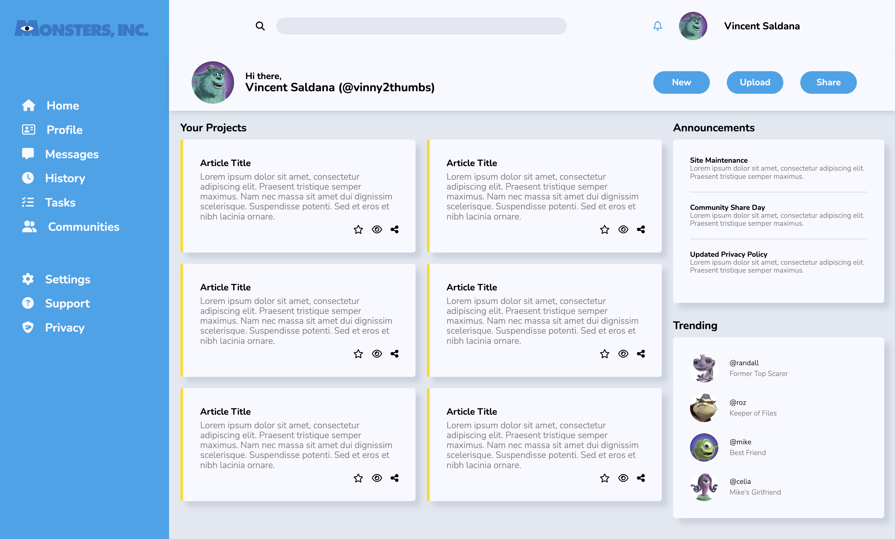

# admin-dash

This is a solution to the [Admin Dashboard](https://www.theodinproject.com/lessons/node-path-intermediate-html-and-css-admin-dashboard).

## Table of contents

- [Overview](#overview)
  - [The challenge](#the-challenge)
  - [Screenshot](#screenshot)
  - [Links](#links)
- [My process](#my-process)
  - [Built with](#built-with)
  - [What I learned](#what-i-learned)
  - [Continued development](#continued-development)
  -[Acknowledgements](#acknowledgments)

## Overview

### The challenge

Build a full dashboard design with an emphasis on CSS Grid. 

### Screenshot

Here's my final design: 

And here's the example provided:

### Links

- Solution URL: [solution](https://github.com/importvince/admin-dash)
- Live Site URL: [live site](https://importvince.github.io/signup-form/)

## My process

### Built with

- Semantic HTML5 markup
- CSS Grid
- CSS Flexbox

### What I learned

1. How to use Grid in combination with Flex effectively
2. How to use minmax() to set column and row sizes
3. How to use auto-fit to set column sizes and make Grid flexible

### Continued development

This project was great practice for CSS Grid and ended up being pretty easy because I decided to try and match the example design. I think from here I'd like to continue practicing minmax() and auto-fit, since those seem to be the trickiest part. CSS can be frustrating on a small screen, so I did this one from my monitor. That'll be something I continue for design work. 

## Acknowledgments

Thank you to Monster's Inc for being such a great movie. 

